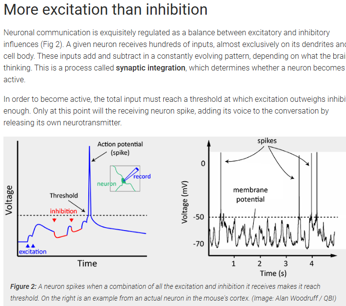

# V Research
We don't have to keep training and weight data on our hardware. Keep it in outside memory modules, upon startup or some signal being set high allow the device to intake training and model data. Based upon the number of positives we get we can allow weights to be changed on our hardware or we can prevent this. We might want to implement this by making our own packet format.... 

Good examples of neuromorphic designs in research and industry: 
- Intel Loihi (1 and 2) (https://www.intel.com/content/www/us/en/research/neuromorphic-computing-loihi-2-technology-brief.html)
- [IBM TrueNorth](https://ieeexplore.ieee.org/document/7229264)
- ODIN (https://github.com/ChFrenkel/ODIN)

These examples are similar to the above three: 
- The SpiNNaker project at the University of Manchester
- The Neurogrid project at Stanford University is a mixed analog–digital neuromorphic system
- The BrainScaleS project at the University of Heidelberg is a mixed analog–digital design
- IFAT from University of California at San Diego
- Golden Gate neurosynaptic core

We need to figure out a way to data... that means that we have to create our own packet format.  

So what is a nueron and a synapse for our use case. We should also very carefully define vocabulary for ourselves that allows us to clearly understand our intentions. 

We need to create our own language???? I really don't want to 

So if we aim to do something similar to TrueNorth then we would do a mixed sync-async design where we do not have a global clock. Cores are locally synchrously and are only clocked when there is a computation to be done. 
- TrueNorth spike packet has a relative dx, dy address for the desitination core, a desitnation axon index, a destination tick at which the spike is to be integrated, and flags... 

Most modern (i.e. post 2016) neuromorphic designs and architectures are in some way inpsired or reference IBM TrueNorth. This would probably be a good point to start with. Our first goal should be to

## Vocabulary and Definitions

- Neuron - does our processing
- Synapse - the connect between the dendrite and the axon
- Axon - wires that go out from the neuron
- Dendrite - connection between the synapse and the neuron
- Axon Terminal - end of the axon -> input buffers? 

## Things we need to figure out before designing

### Use Cases
- Haar-life features, popular for things like recognition of faces or objects... (IBM TrueNorth)
- Local binary patterns, simple texture features  (IBM TrueNorth) -> biometrics from outside data
- Grid Classifier, dtecte and classify all objects in an image simultaneously (IBM TrueNorth)
- 

### Neurons
- Each neuron must have a unique identifier -> log2(# of nuerons) for the identification bits
- Communicate through Synapses
    - in order for a nueron to become active the total inputs from it's synapses must reach a certain threshold

# Jeremiah

Think of it like highway. Each of the roads are something that information can travel through. Neurons are the basic operating unit of the brain, they can basically send a one or zero. 

Nuerons are what compose the network. Neuron has parts.. 

Input signal is going to get recieved by dendrite on one end. Dendrite

Muscle sends signal, with sends signals through brain. Muscle tries to send signal

Dendrite is the area recieves the signal, axon is basically just a wire. Signal passes through the axon gets to the axon terminal. Now it needs to get to the next neuron. Axon terminal is the end of the axon. 

Gap between neuron is the synapse??? 

How does na action potential work? 

What strengthens a connection between the axon terminal and the dendrite

the thalamus get a stimulus, then sends them to the cortex. Thalamus is mission control. So we have to have little centers that decide which way a signal is going to go